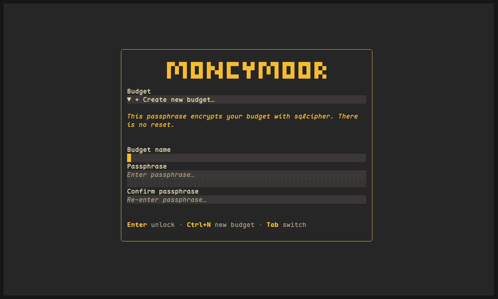

App::Moneymoor
==============

Envelope budgeting for Raku — the "give every pound a job" school (the model YNAB popularised), as a terminal app over an encrypted SQLite (SQLCipher) file.

Two halves, and either is usable on its own: a derivation **engine** that stores only what you authored, and a **terminal UI** built on [Selkie](https://raku.land/zef:apogee/Selkie) that drives it.

```shell
moneymoor                             # the TUI
MONEYMOOR_HOME=/tmp/demo moneymoor    # ...against a throwaway data home
```



(The recording is scripted — `xxt/demo/record.sh` regenerates it with [vhs](https://github.com/charmbracelet/vhs) against a throwaway data home.)

The app
-------

`bin/moneymoor` is the whole user interface. `--version` and `--help` are the only things it will do without a terminal.

Budgets live in the **data home**, `~/.moneymoor/` — one encrypted `*.db` file each, plus `config.json` and an error log. Point `MONEYMOOR_HOME` somewhere else and all three move together, which is what makes a throwaway run safe.

The first screen lists the budgets it found and asks for a passphrase, or — with none to list, or on `Ctrl+N` — offers to create one. That passphrase **is** the SQLCipher key. There is no reset, no recovery question, and no copy of it anywhere: lose it and the file is noise. A wrong passphrase is reported differently from a wrong file, because they are different mistakes.

Inside are three tabs — `1` / `2` / `3` (or `Ctrl+1` / `Ctrl+2` / `Ctrl+3` on terminals speaking the kitty keyboard protocol):

  * **Budget** — the envelope grid for one month, grouped, with Ready-to-Assign above it and a rail beside it that shows exactly how an envelope's available figure was arrived at. `a` assigns, `m` moves money between envelopes, `f` funds every underfunded target at once, `x` explains a derived number, `[` and `]` change month.

  * **Accounts** — ledgers on the left, register on the right. `n` adds a transaction (splits and all), `t` a transfer, `c` cycles uncleared → cleared → reconciled, `Ctrl+R` reconciles against a statement balance.

  * **Reports** — the month's cash flow, and where the money went.

The bottom line always shows the keys that apply to whatever has focus; `Ctrl+H` lists all of them. `Ctrl+G` opens diagnostics — the derivation's warnings, invariant errors, and a digest fingerprint safe to paste into a bug report. `Ctrl+,` opens settings: eleven palettes and two glyph tiers (plain Unicode, or Nerd Font), applied live and remembered.

The idea
--------

You do not budget the money you are going to earn. You budget the money you **have**, by giving every pound of it a job: rent, groceries, the December car insurance bill. When a job costs more than you gave it, you take the money from another job and watch that trade-off happen. That is the whole method, and it only works if the arithmetic is trustworthy.

So Moneymoor stores **only what you authored** — accounts, categories, transactions with their splits, and per-month assignments — and derives everything else on demand with a pure function. Balances, activity, available, Ready to Assign, credit-card payment reserves: all recomputed, never stored. A stored derived number is a cache, and a cache that disagrees with the transactions that produced it is worse than no budget at all.

Targets, and the two ways to hit them
-------------------------------------

Give an envelope a **monthly target** — in its editor, `e` on the grid — and you have said "I want this much available in here each month". Rent £750, Groceries £400. Blank the field to take the target away again.

Three things follow:

  * The grid grows a **Target** column, blank for the envelopes you have not set one on, and each group header shows what its envelopes want between them.

  * The detail rail says how far off you are: `To fund +£72.50` in amber, or `Target met`.

  * The assign field learns two shapes. `=450` means "make this envelope's available £450" — not "assign £450", which is a different number the moment anything carried over or was spent. A bare `=` means "make it the target". Both are ordinary assignments underneath, by exactly the difference.

And `f` does the lot: it lists every visible envelope that is short of its target, with what each would take, the total, and what Ready to Assign will be afterwards — then applies all of it in **one** write, so the budget is derived once and cannot end up half-funded. It only ever adds; an envelope already over its target is left alone. If the total would push Ready to Assign below zero the dialog says so in red, and still lets you do it — that is a real step on the way to a plan, and the pill above the grid will keep saying so for as long as it is true.

Targets are a **view-layer** idea, deliberately. `Service::Budget` has never heard of one: "underfunded" is `max(0, target - available)`, computed where it is drawn. A target moves no money by itself. Only `=`, `f` and your own typing do.

The master invariant
--------------------

Envelopes partition **cash**. Every pound in a cash account is either sitting in an envelope or sitting in Ready to Assign, and no pound is in two places at once:

    Σ available + RTA == Σ cash-account balances

Credit cards are not on the right-hand side: their balance is debt. What is on the left is the card's **payment envelope** — the cash you have set aside to pay it, which the engine fills automatically every time you spend on the card from a funded category.

The general form of the invariant, which the engine checks for every month and the property suite asserts after every single operation, adds the two terms that future-month budgeting and credit-card overspending introduce:

    Σ available(m) + RTA(m) + assigned-in-months-after(m)
                            + credit-overspend(m)
        == cash-balance(m)

`App::Moneymoor::Service::Budget`'s Pod is the full specification — four rules, each with worked numbers.

When an envelope goes red
-------------------------

Three different things, three colours, and the difference is what happens at the period boundary:

  * **Red** — you spent cash you did not have. The envelope resets to zero and Ready to Assign is charged for the shortfall, in that period and every one after it. This is the default and it is the rule that makes the method work: you cannot spend your way out of a hole by ignoring it.

  * **Amber** — you spent on a credit card from an envelope that could not cover it. That is debt on the card, so it is written off at the boundary and nothing else is charged for it.

  * **Purple** — the negative carries forward intact and nothing is charged to Ready to Assign. A card's payment envelope always does this ("you owe more than you have set aside"), and so does any envelope you tick **Carry overspending** on in its editor — the one you deliberately run negative, like an expense you will be reimbursed for.

The toggle is per envelope and off by default, so nothing changes until you ask for it. It is also **retroactive**, because the budget is derived rather than stored: turning it on re-derives every period under the new rule, including Ready to Assign in periods that have already been and gone. That is the honest answer to "this envelope was always allowed to run negative".

Using the engine directly
-------------------------

```raku
use MacOS::NativeLib <sqlcipher>;   # macOS only; see PORTABILITY
use App::Moneymoor::DB;
use App::Moneymoor::Service::Workspace;
use App::Moneymoor::Model::Account;
use App::Moneymoor::Model::Category;
use App::Moneymoor::Model::Transaction;
use App::Moneymoor::Model::Split;

my $db = App::Moneymoor::DB.new(:db-path("$*HOME/.moneymoor/budget.db"));
my $opened = $db.connect('correct horse battery staple');
die $opened.exception.message if $opened ~~ Failure;

my $ws = App::Moneymoor::Service::Workspace.new(:$db);

# Two accounts. The credit card gets a payment envelope automatically,
# in the same SQL transaction.
my $current = $ws.accounts.create(App::Moneymoor::Model::Account.new(
    name => 'Current Account', type => 'cash'));
my $visa = $ws.accounts.create(App::Moneymoor::Model::Account.new(
    name => 'Visa', type => 'credit'));

my $food = $ws.categories.create(App::Moneymoor::Model::Category.new(
    name => 'Groceries'));
my $rta = $ws.categories.rta-category;

# £1,800 of salary in. Inflows are categorized to Ready to Assign.
$ws.transactions.create(
    App::Moneymoor::Model::Transaction.new(
        account-id => $current.id, date => '2026-03-01', amount => 180000),
    splits => [App::Moneymoor::Model::Split.new(
        category-id => $rta.id, amount => 180000)],
);

# Give £400 of it a job. Budgets are keyed by period start; under the
# default calendar-month scheme that is the first of the month.
$ws.set-assigned('2026-03-01', $food.id, 40000);

# £72.50 of groceries, on the card.
$ws.transactions.create(
    App::Moneymoor::Model::Transaction.new(
        account-id => $visa.id, date => '2026-03-14', amount => -7250),
    splits => [App::Moneymoor::Model::Split.new(
        category-id => $food.id, amount => -7250)],
);

my $view = $ws.budget(through-period => '2026-03-01');

say $view.rta('2026-03-01');                            # 140000
say $view.category('2026-03-01', $food.id).available;   # 32750
say $view.category('2026-03-01',
        $ws.accounts.payment-category-for($visa.id).id).available;  # 7250

# Why does the payment envelope hold £72.50?
.say for $view.moves-for('2026-03-01');
# 2026-03-01 card-coverage 3 -> 2 £72.50
#   (out of Groceries, into the Visa payment envelope)

say $view.invariant-errors;                          # []

$db.disconnect;
```

All money is `Int` pence. There are no floats and no `Rat`s anywhere in the engine, the schema or the gateways — `App::Moneymoor::Util::Money` is the only place pence meet human-readable text:

```raku
use App::Moneymoor::Util::Money;

say format-pence(-123456);   # -£1,234.56
say parse-pence('£12.34');   # 1234
```

Settings (`ctrl+,`) picks the currency symbol (`£`, `$`, `€` — display only; nothing converts) and the number format (`1,234.56` or `1.234,56`). Both are saved to `config.json` and applied without a restart. The decimal mark drives parsing too, and thousands are grouped with whichever separator the decimal mark is not, in exact groups of three — so `'1,50'` in `.` mode is an error rather than a 100x-too-large assignment:

```raku
set-money-locale(symbol => '€', decimal-mark => ',');

say format-pence(-123456);   # -€1.234,56
say parse-pence('1.234,56'); # 123456
```

What is in the box
------------------

  * `App::Moneymoor::DB` — SQLCipher connection, idempotent migrations re-run on every connect, and `run-txn` for multi-statement atomicity.

  * `App::Moneymoor::Model::*` — attribute-only row classes with `new-from-row` mapping and predicate methods.

  * `App::Moneymoor::Gateway::*` — the SQL, plus the invariants that must hold before a row is written: splits sum to their transaction, transfers come in pairs, every credit account owns exactly one payment envelope, system rows cannot be deleted.

  * `App::Moneymoor::Service::Budget` — the pure derivation, and the specification of the semantics.

  * `App::Moneymoor::Service::Workspace` — gateways in, derived budget out, plus `set-assigned` and `move-money`.

  * `App::Moneymoor::Util::Money` — pence ↔ `"£12.34"`, in the display locale the settings chose.

And the UI, which never touches SQL:

  * `App::Moneymoor::UI` — app construction, the login handshake, the hand-off to the main screen.

  * `App::Moneymoor::Screen::*` — Login, the shell, one controller per tab.

  * `App::Moneymoor::StoreHandlers` — the state shape, and the one effect every mutation in the app funnels through.

  * `App::Moneymoor::View::*` — the row and span builders. Pure functions: no widget code decides what a number says.

  * `App::Moneymoor::Theme` / `Themes` / `Service::Icons` — the eleven palettes and the two glyph tiers.

Not in v0.1
-----------

Scheduled transactions, CSV and bank imports, multi-currency, incremental rollup caching, and net worth over time (which wants a per-month, per-account balance derivation the engine does not have yet).

Monthly targets shipped after v0.1 (see above). YNAB-style **goals** — rolling targets, due dates, "put aside another £X a month until March" — did not: a goal is a plan with a clock in it, and every figure in this app so far is a plan with only arithmetic in it.

Portability
-----------

The `sqlcipher` shared library has to be loadable by NativeCall. On macOS put `use MacOS::NativeLib E<lt>sqlcipherE<gt>;` before the first `use App::Moneymoor::DB`; on Linux and Windows the system loader finds an installed sqlcipher without help. The pure engine — `Service::Budget`, `Util::Money`, every `Model` — needs no native library at all, which is why the budgeting tests run everywhere regardless.

Testing
-------

```shell
prove6 -Ilib -I../Selkie/lib -I../Notcurses-Native/lib t/
```

Forty-four files. Sixteen are the engine's: the DB layer, every gateway, one per budgeting rule, an explain-the-number walkthrough, and a seeded-PRNG property suite that builds hundreds of random-but-legal budgets one operation at a time and asserts, after every single one, that the master invariant holds, that the move ledger is a consistent double entry, and that recomputing from the same facts in a different order gives a byte-identical result.

The rest are the UI's, and none of them needs a terminal: `Selkie::App` calls `notcurses_init` in its constructor, so every view function is pure and tested as one, and every tab is mounted and driven through a real store over a real SQLCipher budget with the app itself stubbed out.

AUTHOR
======

Matt Doughty <matt@apogee.guru>

COPYRIGHT AND LICENSE
=====================

Copyright 2026 Matt Doughty

This library is free software; you can redistribute it and/or modify it under the Artistic License 2.0.

